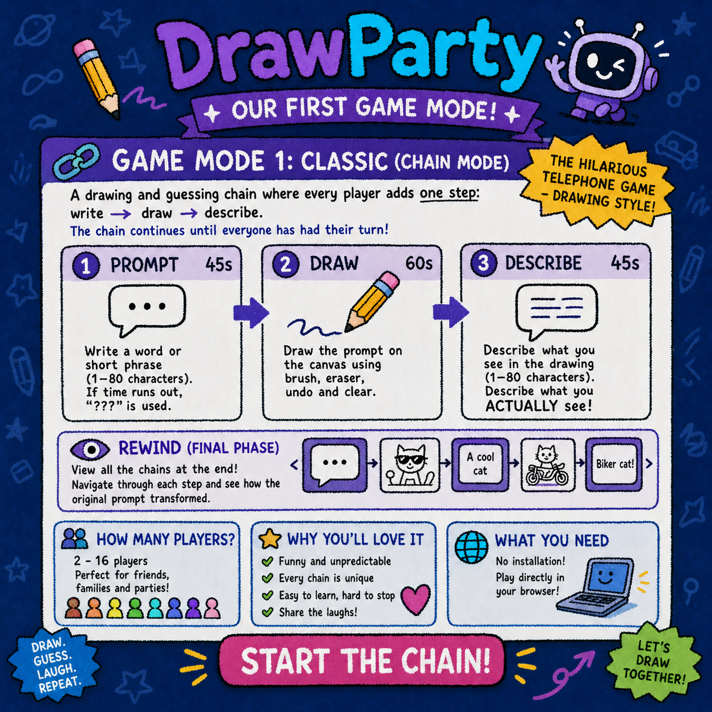

# DrawParty 🎨

A real-time multiplayer drawing game built by a 9-student team for the *Projet Intégrateur* at Université de Strasbourg. It ships as a web app, an installable PWA, and a Linux desktop app (Electron/AppImage), all from one codebase.



## Game modes

- **Skribbl** — classic draw-and-guess: one player draws a secret word, the others race to guess it in chat, with progressive letter hints.
- **Gartic Phone** — the telephone game with drawings: players alternate between writing prompts and drawing the previous player's prompt, then everyone watches the chain unravel.
- **AI Judge** — you draw, and a **vision LLM (Llama 4 Scout via Groq)** tries to guess your drawing in real time, respecting the same letter-hint constraints as human players. Limited guesses per round keep it fair (and the API bill sane).

## Architecture

```
drawparty/           Frontend — Next.js 16 + React 19, Fabric.js canvas,
                     socket.io client, Clerk auth, PWA + Electron packaging
drawparty-backend/   Backend — Express + socket.io, Prisma/PostgreSQL (Neon),
                     per-mode game services, Groq vision integration
docs/                Specs, wireframes, architecture diagrams, project report
```

Real-time gameplay (strokes, guesses, timers, lobby state) flows over **socket.io** rooms; persistent data (users, friends, game history) lives in **PostgreSQL via Prisma**. Authentication is **Clerk** end-to-end: the frontend session token is verified by backend middleware on both HTTP routes and socket handshakes.

Both packages have **vitest** test suites with coverage, run per-package in CI (`.gitlab-ci.yml`) — a frontend-only commit doesn't trigger backend tests.

## Run locally

Requires Node.js 20+.

```bash
# backend
cd drawparty-backend
npm install
cp .env.example .env   # DATABASE_URL, CLERK_SECRET_KEY, GROQ_API_KEY
npm run dev            # http://localhost:3001

# frontend
cd drawparty
npm install
npm run dev            # http://localhost:3000
```

Tests: `npm run test` (or `npm run test:coverage`) in either package.

## Desktop app (Linux)

DrawParty packages as an **AppImage** — no install, just run:

```bash
cd drawparty
npm install
npm run electron:build           # outputs AppImage to dist-electron/
chmod +x dist-electron/DrawParty-*.AppImage
./dist-electron/DrawParty-*.AppImage
```

If you hit a FUSE error (Ubuntu 22.04+ / Fedora 37+ / Arch): install `libfuse2` / `fuse` / `fuse2` with your package manager.

## Project documentation (`docs/`)

The full engineering process is in the repo: functional specifications (`docs/specification/`), UI wireframes (`docs/wireframes/`), architecture diagrams (`docs/architecture/`), the requirements document (`cahier_des_charges.pdf`), and the final report (`rapport.pdf`). Most documents are in French.

## Team

Adam Nouira · Rami Hasan Mohamad Jasem · Yann Koehler · Xavier Lauber · **Daniil Maklakov** · Avend Malki · Eros Mallet-Covic · Fadel Mende · Serge Mukoka
